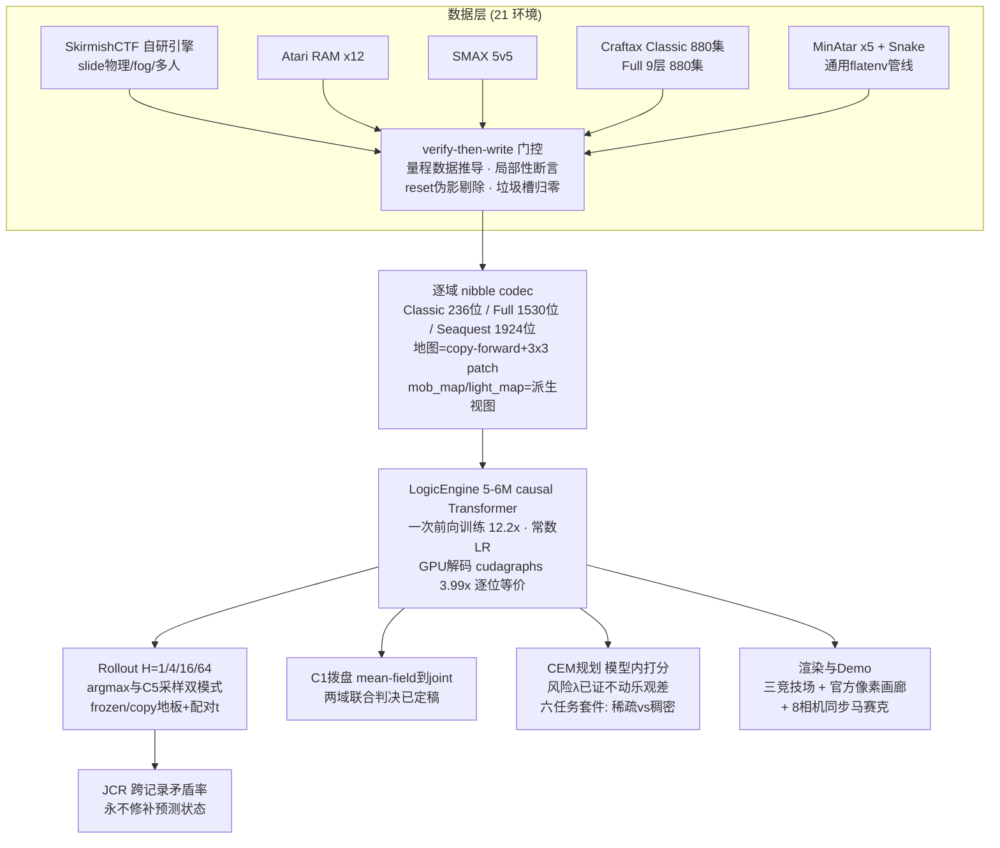

# AgentWorld 阶段报告（2026-08-25）

这个项目在验证一个关于世界模型的具体主张：不去预测像素，而是直接预测游戏引擎里那份"权威状态表"（authoritative typed state——每个实体的坐标、血量、朝向、库存、地形格子的类型），能同时得到长时域一致性、可规划性、可渲染性和多人一致性。出发点是本组前作 MASS（arXiv 2608.06257）：它把下一时刻状态拆成"每条记录独立预测"的乘积，这是一个 mean-field 近似，只有当各记录的局部上下文恰好相互隔离时才精确；两个人抢同一格、两束弹打同一目标，都是反例，而 MASS 自己的合法性检查对这种"单条都合法、拼起来矛盾"的错误结构性失明。我们的核心贡献有三件：C1 是给这个近似装一个可拨的"拨盘"（把一个 tick 内的记录分成 g 组顺序解码，g=1 就是 MASS 原味，拉满就是完全自回归 joint）；JCR（Joint Contradiction Rate）是专门数跨记录矛盾的新指标（占位冲突、同旗双持、成就单调性回退、mask 已死但字段带脏值），配套铁律是预测出的状态永远不许修补——非法本身就是被测量的对象；C5 是把环境私有随机性（mob 的随机游走）从 argmax 预测改成按拟合分布采样。方法上还有一条贯穿一切的纪律叫 verify-then-write：任何量程、槽位数、局部性假设都必须先在数据上测量再写入编码器，这条纪律的战绩包括训练前拦下过三次静默数据污染（血量量程差 45 倍、冷却时间冲到 −403 击穿边距、骷髅槽位数是 2 不是 3）。

模型刻意保持极简，好让结论归因于状态表示而不是架构魔法：所有战场共用同一个 LogicEngine——5-6M 参数、6 层、d_model=256 的 causal Transformer，词表只有 20 个 token（4 个结构符 + 16 个十六进制 nibble）。任何状态被编成 nibble 序列 `[BOS 动作] [t 时刻全部字段] [OUT] [t+1 全部字段]`，训练用"一次前向"技巧（causal LM 天然在每个位置给监督，teacher forcing 下所有目标一次拿全，SMAX 上实测 12.2 倍提速、改写前后逐位等价 7e-7）；学习率用常数不用 schedule——我们和 Mac 端并行会话反复验证过"退火端点 vs 移动权重"是两种不可直接对表的物件，常数 LR 保证任何两次运行在同一步数下同类。推理是按拨盘分组的增量解码；本周把 GPU 解码打快了 3.99 倍（542→136ms）：预分配 KV cache 池 + 原地长度计数 + 掩码注意力使每步形状全静态，再用 torch._dynamo.mark_static_address 解锁 CUDA graphs 整步捕获——手术前后解码状态逐位相同（连 bf16+cudagraphs 配置也逐位），这套路径现在惠及所有 GPU 评测。评测纪律三件套永远在场：frozen 地板（什么都不做得几分）、copy 基线、192 共享起点的 per-start 配对检验；本周又从 Mac 端会话学来两条并已实装：t 统计量的 argmax 也是 argmax（16 格挑 |t| 最大会选中低方差抽样而非大效应）、判"衰减"必须配对差自身 resolved（晚期 t 不达标只是功率不足的同形）。

数据全部公开或自产。战场版图本周从 15 个环境扩到 **21 个**：自研 SkirmishCTF（规则取自 Melting Pot 的 paintball capture-the-flag，向量化引擎支持 snapshot/restore、状态注入、RNG 全录——反事实、群体外推、精确 rollout 监督的先决条件）滑动物理版 1000 集语料；Atari 12 游戏的模拟器 RAM（128 字节 RAM 就是权威状态，屏幕是它的确定函数）；SMAX 5v5 星际微操；Craftax 两档（Classic 64×64 从 80 集扩到 880 集共 37 万 transition，Full-Symbolic 9 层楼 84,033 个状态标量同样 ×11）；本轮新增 **MinAtar 五游戏**（gymnax JAX 版，状态 36~1919 标量，Seaquest 的五个 100 槽实体族是记录结构压力测试）与 **jumanji Snake**（MASS 自家基准的域，变长身体链是全版图独有的记录结构），六个新环境用**一套通用管线**接入（统一生成器显式记录 reset 边界、按 leaf 数据推导量程、浮点整数性自动检测——MinAtar 的 float 地图实为 0/1 于是整型精确编码、通用一次前向训练器按序列长自适应 batch）。生成侧的坑照例先测后写：本版 gymnax 的 step 返回 6 元组（terminated/truncated 分离），随机策略下 Breakout 回合太短导致 64 步无 reset 窗口不存在——评测因此改成自适应视界，且单环境失败不再孤儿化批次里其余环境。

到今天为止全部站得住的跑分，按战场排。SkirmishCTF：滑动物理模型位置精确率 H=1/8/32/128 分别 98.2/65.7/35.4/18.6%，occupancy 类 JCR 为零；学习渲染器（entity-token cross-attention、亚格双线性 splat 输入）验证集 PSNR 36.96；Khora（2608.08600，population-scalable 多智能体世界模型）协议对标完成 4/5——多视角质量在 2/4/8 视角下完全平坦（PSNR 28.5/28.4/29.2，他们的招牌性质我们结构性成立），且做出他们做不了的分解：渲染器几乎透明（true-state 渲染 LPIPS 0.006），95% 感知误差来自动力学漂移；延迟-population 曲线实测到 N=1024（他们只测到 64）——单视角渲染 5.2→6.9ms 全程平坦，模型解码的扩展轴是世界面积而非人口；动态增删 agent 配对判决零超额矛盾（对照臂反而揭示真信号：小人口训练的模型在 N=32 时 28/30 tick 违反 JCR——群体外推是真正的前沿）；8 相机同步马赛克（同一预测态渲出）肉眼可验跨视角一致。Atari：H=1 上中档拨盘好于满档，12 游戏 game-level 符号检验 9:0（p=0.0039）；teacher-forced CE 检验无顶档上升（5 升 7 降 p=0.77，与 DMC 域 0/8 同向）⇒ 这笔赤字在解码期不在拟合层。SMAX：拨盘长视界效应在配对 Δ 判据下"无衰减证据"（12 格 11 格，唯一 resolved 恰为机会水平），与 DMC 域联合措辞已定稿共享（docs/JOINT_WORDING_DIAL.md 是两边共同引用的单一事实源）；H=1 是轨迹稳健的负差（36 点 34 负）。Craftax Classic：11 倍数据后 teacher-forced 整状态 0.109，rollout 一步 0.219（frozen 地板 0），64 步地图 0.547（frozen 0.25）；逐字段账本显示 97.7% 误差质量在环境私有随机数驱动的 mob 槽（奶牛 NLL 0.68/nibble vs 玩家 0.038——分布已拟合，argmax 撞随机之墙，C5 采样评测已实装）；规划是最强阳性：预注册 n=64 下模型内 CEM 的单承诺计划均值是承诺配对地板的 5.4 倍，砍两棵树的深计划 fresh 子集 9/48 vs 随机双地板 0/48（Fisher p≈0.003），与烧 24 倍环境调用的 oracle 打平；风险规避 λ 三臂证明乐观差（信念 2.4 vs 兑现 0.7）不随采样离散度惩罚移动——它是系统性偏置不是方差，下一杠杆是双模型 epistemic 分歧；六任务套件给出清晰模式——稀疏/链式任务（找水喝 12.5%、造工作台 4.2%）模型规划是唯一有效者（双地板全 0/24），机会稠密任务（采树苗）selection 地板反超（62.5% vs 8.3%），三链 40 步全零是当前天花板。Craftax Full：11 倍数据后 teacher-forced 0.204（打折读法：语料只行使 0 层动态），changed-nib 单步精度 78.6%，patch-vs-copy-forward 从"输"治到"平或小胜"；mask 一致性违例 71/136 槽/态经 11 倍数据零改善——训练分布里根本不存在这种样本，是暴露期解码条件化失败，直通 C1 的解码问题，已列专门实验方向。新六环境的首批数字（训练进行中已出四个）：teacher-forced 整状态 Breakout 0.9990、Freeway 0.9990、SpaceInvaders 0.9590、Asterix 0.8965；完整 rollout 更漂亮——Freeway 64 步整状态自回归精确率 95.3%、Breakout H16 98.4%/H64 67.2%、SpaceInvaders H16 70.3%（changed-nib 一直 93%+）、Asterix 是六者中最难（H4 53.1% 后塌向 0，实体 8 槽随机 spawn 的外生性是主因，与 Craftax mob 同病）。

demo 侧一段坦白账。用户四次反馈"玩在模型里"太卡之后的完整测量链：CPU 上 770ms/tick 的墙先后毙掉两个假设（mask 缓存 1.00×、torch.compile 1.04×），cProfile 定罪 SDPA/linear 的微型形状内核调度；GPU eager 只到 2.3fps 后做静态 KV 手术拿到 3.99×，模型权威竞技场实测 5.1fps（渲染同步异步化后）。但 GPU demo 常驻六小时整会被集群管理员回收（两次实证，时长分毫不差 6h03——"真实推理负载"抗辩无效，这是管理策略不是利用率监控），所以稳态部署回到：8777 端口 CPU 引擎权威 10fps 流畅版（模型作异步影子 pane + 位置一致率实时条，pane 级增量线协议把带宽从 560 压到 128KiB/s），8779 端口 CPU 模型权威原教旨版（~1.3fps 是 CPU 自回归解码的物理，标注如实），GPU 版仅按需起（知道 6 小时钟在走）。8778 是 Atari 街机厅。画廊页 /gallery 挂着 Craftax 真值|预测双栏 GIF（官方像素渲染器绘制，最好一集 64 步里位置地图 61 步逐位不漂）和 Skirmish 马赛克。

正在跑的与接下来的。flatenv_train_retry1（258907）：六环境串行训练+评测，已完成四个（Breakout 复用已训权重），Snake 训练中，Seaquest（序列 3853 最长）殿后，预计还需约 1.5–2.5 小时全收。GitHub demo page 正在本报告发布的同一批工作里搭建（可视化 GIF 画廊 + 跑分表 + 本报告，见仓库 README 链接）。之后的队列按价值排：K2 机械化跨视角一致性补完 Khora 5/5；slide 群体多样性重训（治 N=32 的 JCR 28/30）；full-Symbolic 的 mask 一致性专项（decode 顺序干预）；Craftax 规划的 epistemic 分歧打分；以及把梯子寻路加进 Full 语料策略让 9 层楼真正被行使。Mac 端并行会话按分工推进 ManiSkill（世界模型侧此前无人占用），双方在 docs/JOINT_WORDING_DIAL.md 上共享拨盘结论的最终措辞，长正文一律文件优先、消息只发路径——这是丢过一次正文后立的规矩。
